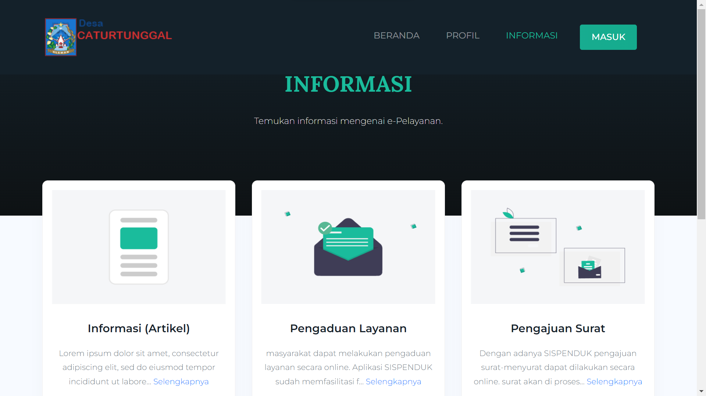
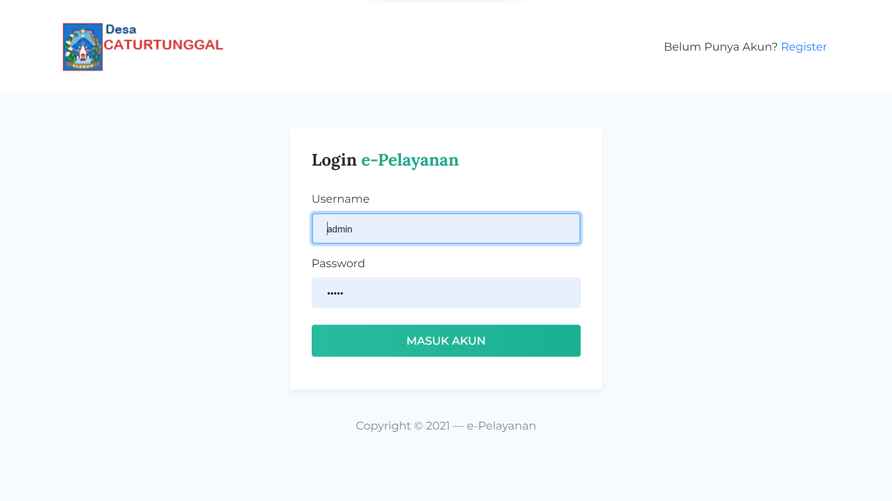
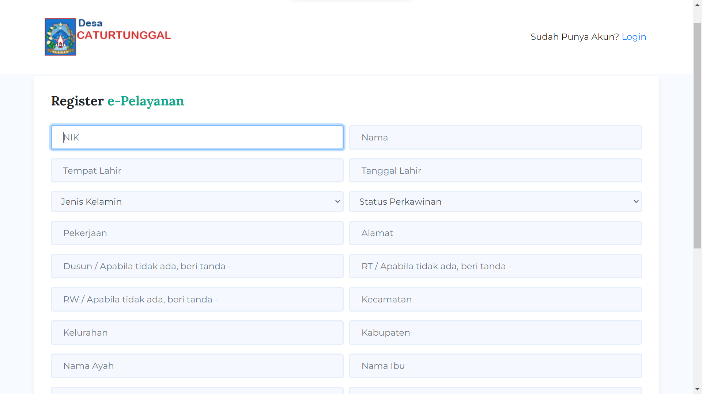
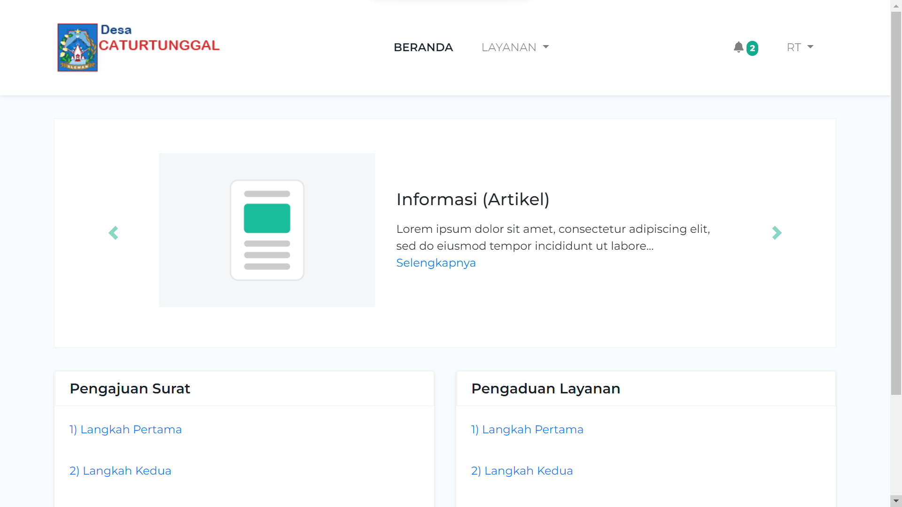
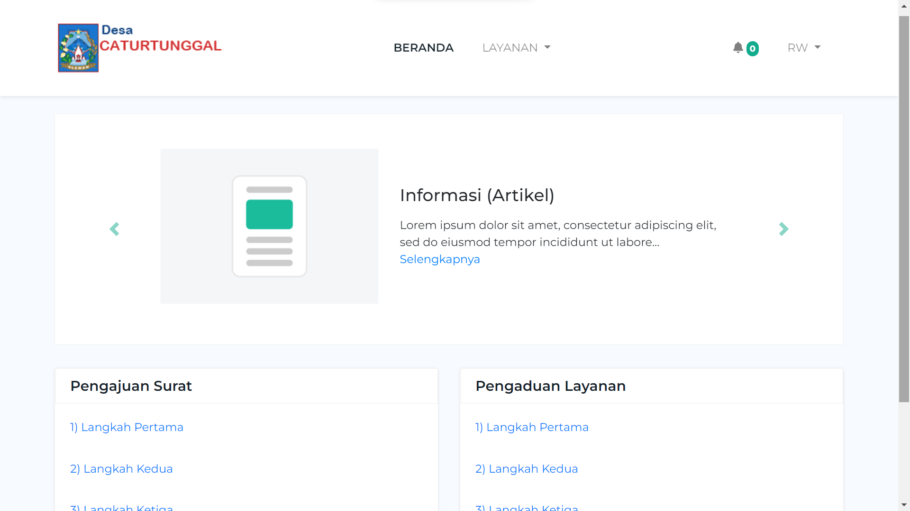
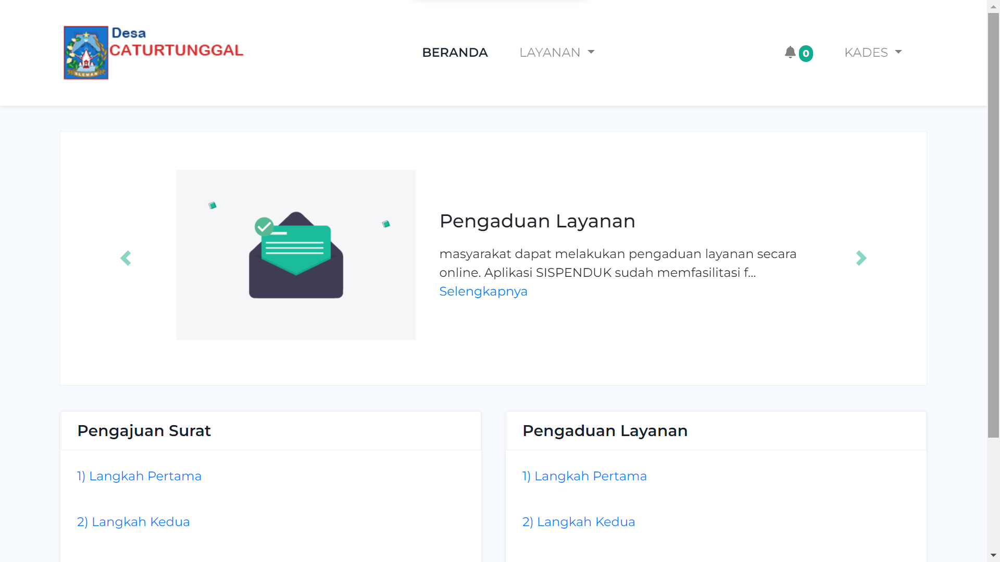
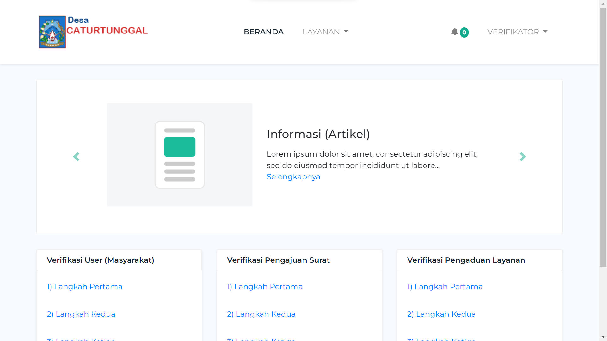

## STEP-STEP SISPENDUK

- import database sispenduk.sql
- copy .env.example -> .env
- composer install -> untuk vendor
- php artisan route:clear
- php artisan config:clear
- php artisan cache:clear
- php artisan storage:link
- php artisan serve

## HAK AKSES

#### Admin
Username : admin  
Password : 12345

#### Verifikator
Username : verifikator  
Password : 12345

#### RT
Username : rt  
Password : 12345

#### RW
Username : rw  
Password : 12345

#### KADES
Username : kades  
Password : 12345

#### User Masyarakat
Username : rizki  
Password : 12345

#### Orang yang verifikasi

Verifikator -> RT -> RW -> Kades

## Screenshoot

#### Front End (Beranda)

    <ul style="list-style: none; padding: 0;">
        <li> Beranda 1
             
        </li>
         
        <li> Beranda 2
            
        </li>
         
        <li> Profil 1
            
        </li>
         
        <li> Profil 2
            
        </li>
         
        <li> Profil 3
            
        </li>
         
        <li> Informasi
            
        </li>
    </ul>

#### Front End (Berita/Artikel)

     

#### Back End (Login & Register)

    <ul style="list-style: none; padding: 0;">
        <li> Login
             
        </li>
         
        <li> Register Penduduk
            
        </li>
    </ul>

#### Back End (Tampilan User)

    <ul style="list-style: none; padding: 0;"> USER ADMIN
        <li> Tampilan User Admin
             
        </li>
         
        <li> Tampilan User Admin
            
        </li>
    </ul>
    <ul style="list-style: none; padding: 0;"> USER PENDUDUK
        <li> Tampilan User Penduduk
             
        </li>
         
        <li> Tampilan User Penduduk
            
        </li>
        <li> Tampilan User Penduduk
            
        </li>
    </ul>
    <ul style="list-style: none; padding: 0;"> USER RT, RW, KADES
        <li> Tampilan User RT
             
        </li>
         
        <li> Tampilan User RW
            
        </li>
         
        <li> Tampilan User KADES
            
        </li>
    </ul>
    <ul style="list-style: none; padding: 0;"> USER VERIFIKATOR
        <li> Tampilan User Verifikator
             
        </li>
    </ul>

